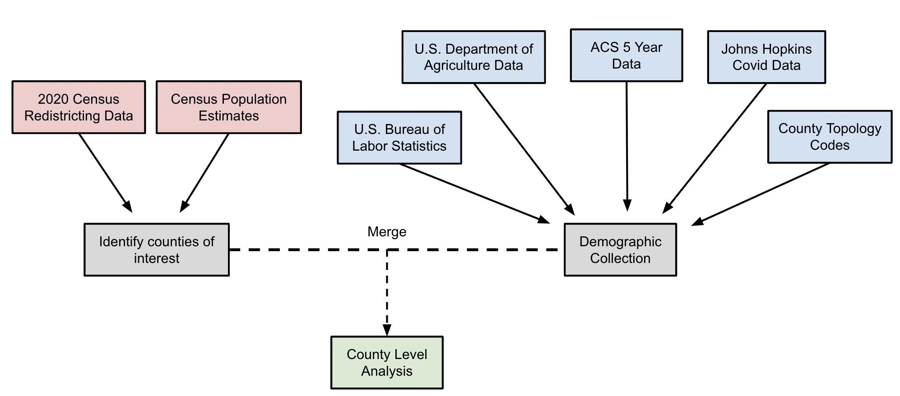

# Auditing the Census: Evaluation of the 2020 Decennial Census in North Carolina

## Background and Motivation

Article 1, Section 2 of the United States Constitution contains a seemingly simple directive: every ten years, the people of the United States must be enumerated. The Census Bureau undertakes this responsibility by attempting to count every person in the country, an estimated 330 million people. While the legal purpose of the decennial census is to ensure equal and fair representation in the federal government, population estimates also help local and state governments direct resources and build more effective policies.

Due to the importance of population estimates, there is significant concern about the accuracy of the estimates. In fact, the Census Bureau estimates that there are certain demographic groups that are undercounted nationally in the 2020 census, including Black Americans, Hispanic Americans, and children (age 0-17). However, no information about sub-state accuracy or state-level demographic accuracy is available from the Bureau. This is especially relevant because many states generate their own population estimates, using the census counts as a base. States can therefore adjust the census estimates with their own models, hopefully reducing bias and increasing accuracy.

For this project, we worked with the North Carolina Office of State Budget and Management (OSBM) with the goal of achieving the following:

1. Compare the 2020 census count of population and housing counts to the US Census Bureau's 2020 population and housing count evaluation estimates. This evaluation includes measures of coverage error by county characteristics.
2. Evaluate various datasets for their usefulness in providing correlates of population and population change in order to improve post-census population estimates and adjust 2020 census results if warranted.

This work will help the OSBM adjust their own estimates, if necessary, to remove bias and improve the accuracy of estimates. These estimates are used to assign funding for schools, arts, street maintenance, and population projections used for future planning.  Indirectly, this work will serve North Carolinians, whether they use population estimates or not. Less biased estimates will ensure equitable distribution of goods and services, both in the public and private sectors.

## Data

### Original Data Sources

Significant amounts of data were utilized in this project, from many sources (mostly from Federal government agencies). All original datasets can be found in the [00_source_data](00_source_data/) folder. Brief descriptions of some of the most relevant datasets and their origin can be found below:

- [County Level 2020 Housing and Population Counts](00_source_data/2020_counts_NC.csv): Counts of population, housing, and group housing populations from the 2020 decennial census (Public Law Redistricting File).
- [Tract Level 2020 Housing and Population Counts](00_source_data/2020_counts_NC_tract.csv): Counts of population, housing, and group housing populations from the 2020 decennial census (Public Law Redistricting File).
- [County Level Housing Estimates in North Carolina](00_source_data/housing_counts_NC.csv): Estimates of housing counts (number of housing units) in North Carolina between 2010 and 2020 from the Census Bureau. These estimates are derived from the 2010 decennial census and modified with other sources of data.
- [County Level 2020 Demographic Characteristics](00_source_data/2020_acs_demographics): Demographic estimates (age, race, sex, etc.) in North Carolina. Obtained from the American Community Survey in 2020.
- [County Level Population Estimates in North Carolina](00_source_data/co-est2020-alldata.csv): Estimates of population  in North Carolina between 2010 and 2020 from the Census Bureau. These estimates are derived from the 2010 decennial census and modified with other sources of data.
- [Covid-19 Mortalitly in the United States](00_source_data/covid_deaths_NC.csv): County-level Covid-19 mortality by day in 2020. Obtained from Johns Hopkins University.
- [County Typology Codes](00_source_data/2015CountyTypologyCodes.csv): County-level classification codes (i.e. farming, rural, urban, manufacturing, etc.) for the United States in 2015. Obtained from the Economic Research Service in the U.S. Department of Agriculture.
- [County Level Education](00_source_data/Education.xlsx): County-level education statistics for the United States in 2016-2020 from the U.S. Census Bureau.
- [USPS Vacant Addresses Data](00_source_data/NC_vacancy_q4_21.csv): Total and vacant address counts by quarter and census tract. Obtained from the U.S. Department of Housing and Urban Development
- [County Level Poverty Estimates](00_source_data/PovertyEstimates.xlsx): County-level poverty estimates in 2020 for the United States from the Census Bureau.
- [Parcel Data in Anson County](00_source_data/anson-parcels/): Administrative land parcels record for Anson Coutny in North Carolina. Obtained from NC OneMap.
- [Parcel Data in Bladen County](00_source_data/bladen-parcels/): Administrative land parcels record for Bladen Coutny in North Carolina. Obtained from NC OneMap.
- [Parcel Data in Graham County](00_source_data/graham-parcels/): Administrative land parcels record for Graham Coutny in North Carolina. Obtained from NC OneMap.

### Data Merging

For most datasets, merging was done on a county level using either county names or FIPS code. In order to obtain ideal samples for analysis, there were several required steps. The image below highlights our initial data merging process. In order to compare previous estimates to the Census counts, previous estimates and the 2020 Decennial Census counts were merged. Similarly, demographic data from several sources were merged at the county level and then merged with the population estimates/counts. The final data product can be found [here](05_intermediate_data/merged_pop_data_revised.csv), and this data was used to conduct analyses for **Goal 1**.



## Code and Analysis

All requirements for this projct are listed in the [requirements.txt](requirements.txt) file. The Python version used for this project was 3.9.7.

### Code Overview

The code in this project is separated into four distinct buckets:

1. [10_data_processing](10_data_processing/): Data obtaining (APIs), cleaning, and merging. All work shown in the diagram above happened in this folder.
2. [20_demographic_analysis](20_demographic_analysis/): Conducting the analysis for **Goal 1**. Comparing previous estimates of housing and population to the 2020 Decennial Census counts, and exploring how the differences between these estimates correlates with demographic and socioeconomic characteristics.
3. [30_dataset_exploration](30_dataset_exploration/): Exploration of several datasets which have to potential to augment estimates. Highlighting of strengths and weaknesses between
4. [40_housing_estimates](40_housing_estimates/): From **Step 3**, two datasets were identified that had the potential to improve housing counts in North Carolina. These datasets and their relationship to the 2020 census hosuing counts were investigated here. The work here is focused on **Goal 2**.

## Results and Next Steps

Our extended methods and results can be found [here](https://github.com/sarwaridas/carolina-demography/blob/main/50_results/Final_Report.docx.pdf), but below are listed the major findings of our work:

1. There is likely significant geographic variance in population and housing coverage error in North Carolina. Specifically, eastern North Carolina counties show significantly lower population and housing counts in the Census when compared to previous estimates. Additionally, counties with potential undercounts have significantly higher Black populations than counties without undercounts, raising additional concerns about bias in the estimates.
2. Administrative data sources within North Carolina are fairly robust and have to potential to de-bias estimates. Specifically data available from NCOneMap has information about every parcel of land in North Carolina. However, lack of data standardization by county significantly hampers the usability of this data.

In preperation for the next decennial census, the OSBM should work with other state agencies to better align reporting standards and allow this data to be a useable input into OSBM population modules.

## Replicating Our Work

If your interested in replicating any part of our work, follow the instructions below.

**Step 1: Clone the repo.**

```
git clone https://gitlab.oit.duke.edu/duke-mids/workingprojectrepositories/carolina-demography.git
```

**Step 2: Navigate your way into the repo.**

```
cd carolina-demography
```

**Step 3: Install Necessary Packages.**

```
pip install requirements.txt
```

**Step 4: Obtain API Keys from the Census.**

In order to run this, you will need to get an API key from the [Census Bureau](https://api.census.gov/data/key_signup.html). Then you will need to create a `.env` file with this API key in the root directory, following the format from [the provided example](.env_example). This will allow you to use the files in [10_data_processing](10_data_processing/) to obtain data directly from the Census API.

**Step 5: Run Analyses of Interest.**

With an API Key and the data in the [00_source_data](00_source_data) folder, you can run any of the analyses from this project, separated by the folders listed above. You can also create your own analyses from the data.
